# NASCON Registration & Management System

A full-stack web application for managing registrations, sponsorships, and event information for **NaSCon** — FAST-NUCES Islamabad's flagship annual student convention featuring competitions across tech, business, gaming, and cultural domains.

---

## Features

- **User Authentication** — Login and signup with role-based access (Participant, Sponsor, Event Organizer, Admin)
- **Participant Registration** — Individual and team registration for 15+ events
- **Sponsor Registration** — Tiered sponsorship packages (Platinum, Gold, Silver, Bronze)
- **Organizer/Admin Dashboard** — View all registered participants by event and all sponsors
- **Accommodation Management** — Optional accommodation booking during registration
- **Multi-page Frontend** — Home, Events, Organizers, Judges, Sponsors, Register, FAQs, Contact pages

---

## Tech Stack

| Layer | Technology |
|-------|------------|
| Backend | Node.js, Express.js |
| Database | MySQL (via mysql2) |
| Frontend | HTML, CSS, JavaScript |
| Other | body-parser, dotenv |

---

## Screenshots

### Login Page
Users can log in as Participant, Sponsor, Event Organizer, or Admin.

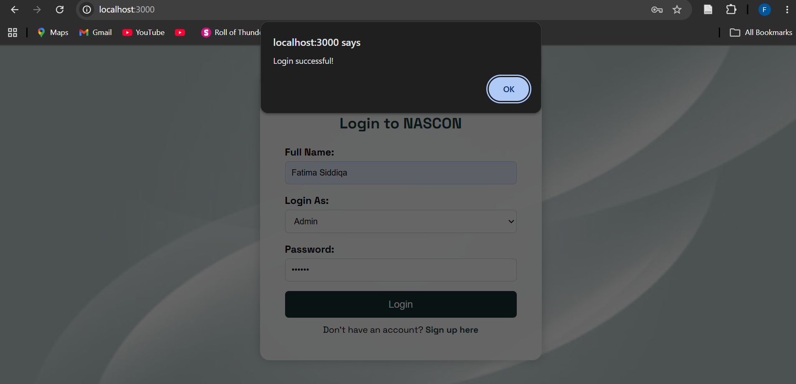

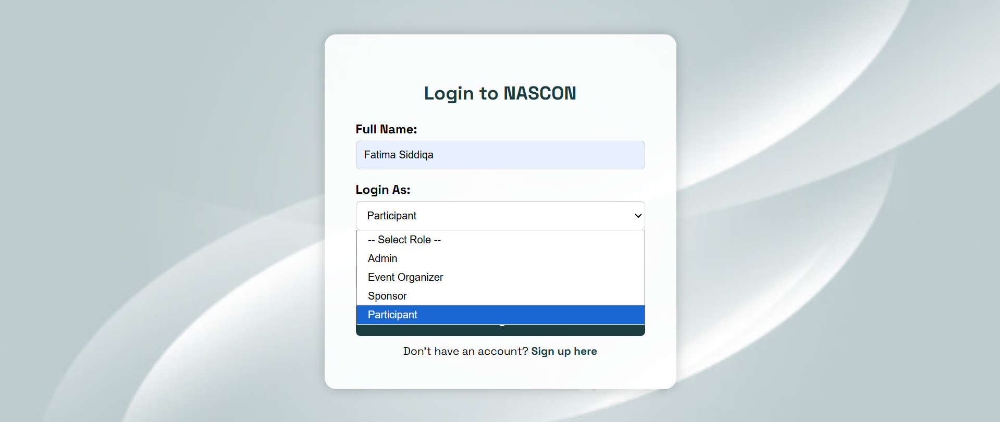

### Sign Up
New users can create an account before logging in.

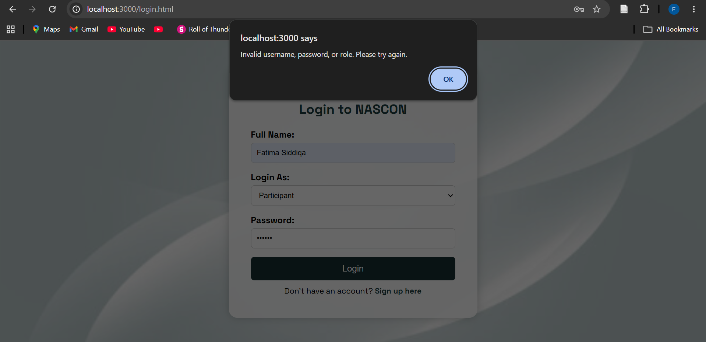


### Home Page
Participants are redirected here after login — showcasing NASCON events, organizers, and sponsors.

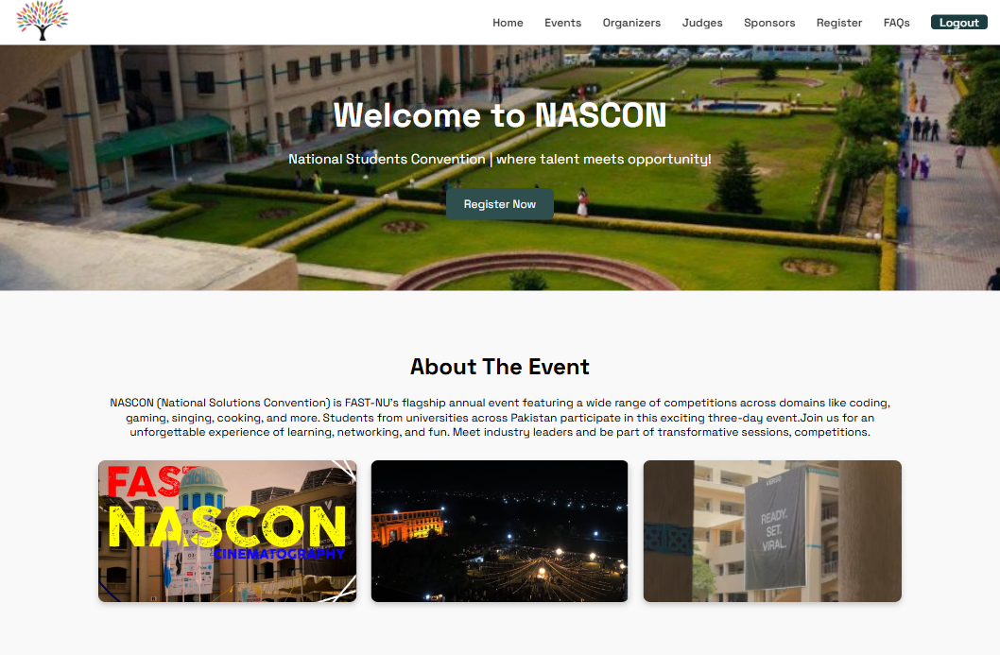

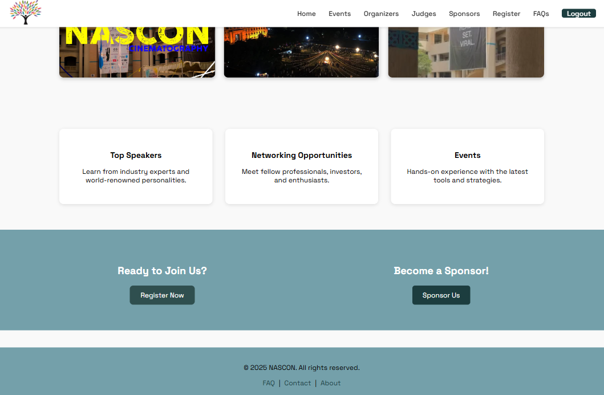

### Events Page
Browse all events across Tech, Business, Gaming, and General categories.


Click on Read More button to access exclusive events of each category.
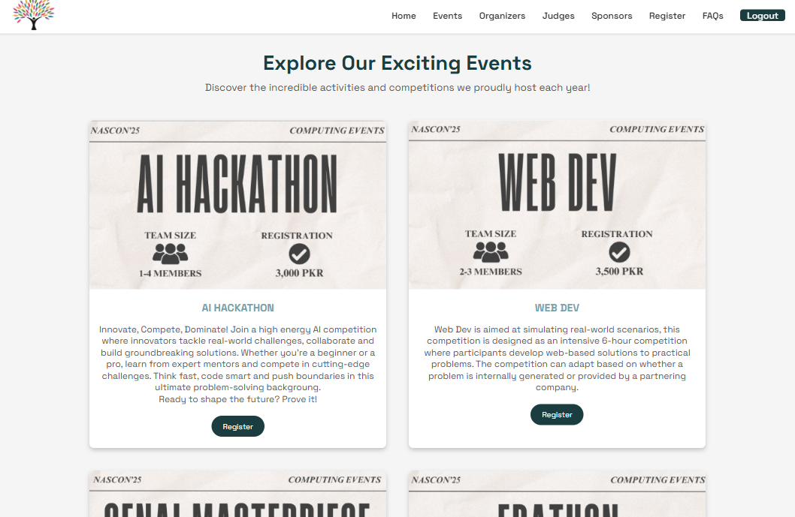

### Registration Form
Register as an Individual or Team for any event, with optional accommodation.

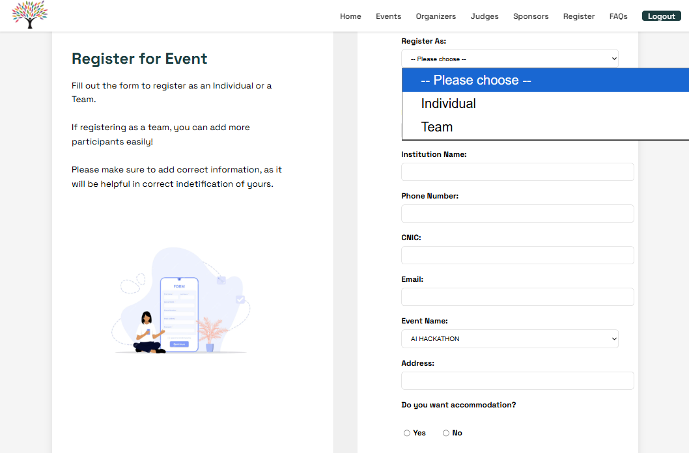

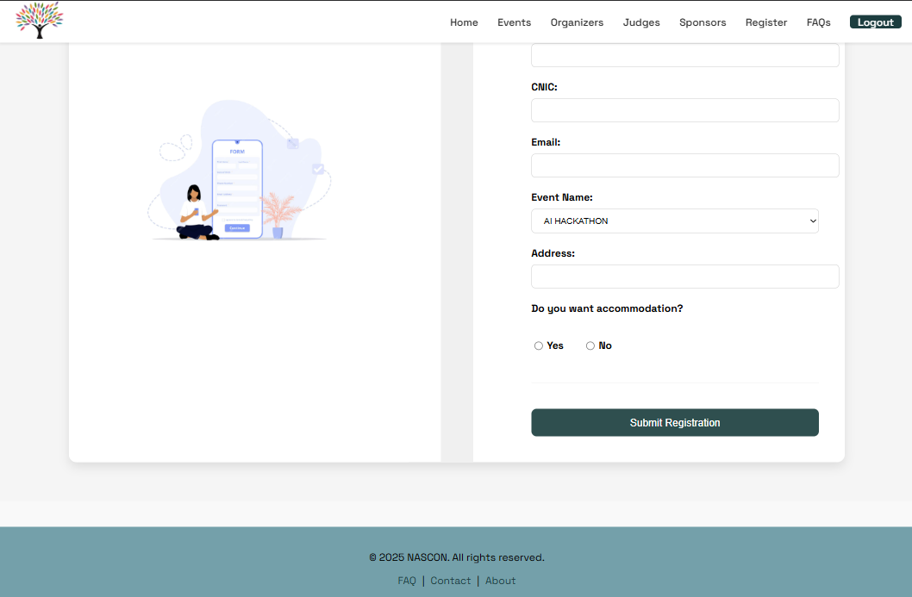

### Organizers Page
Meet the organizing societies and their event assignments.

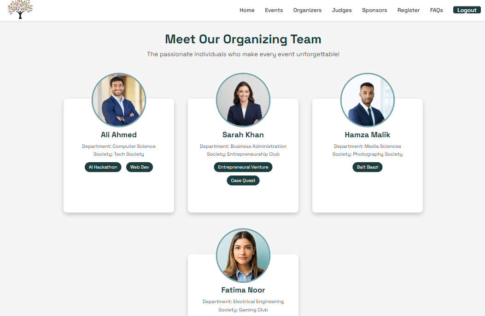

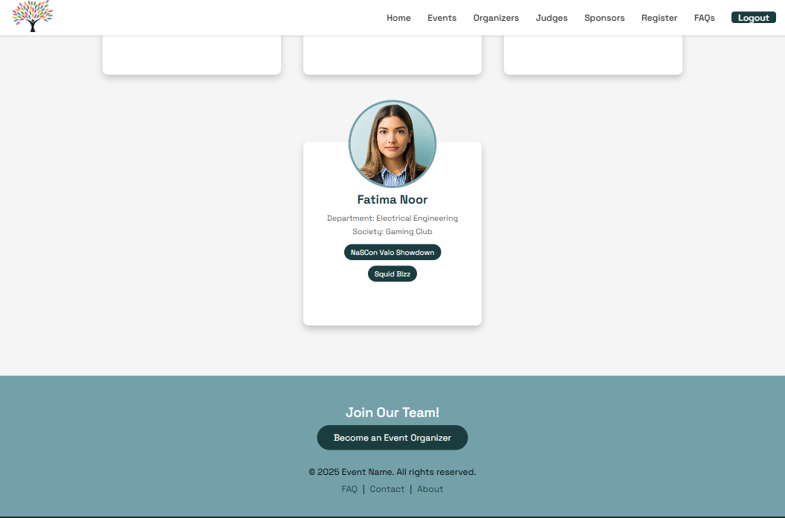

### Judges Page
View the judges and their areas of expertise.


### Sponsors Page
View past sponsors by tier (Platinum, Gold, Silver, Bronze).

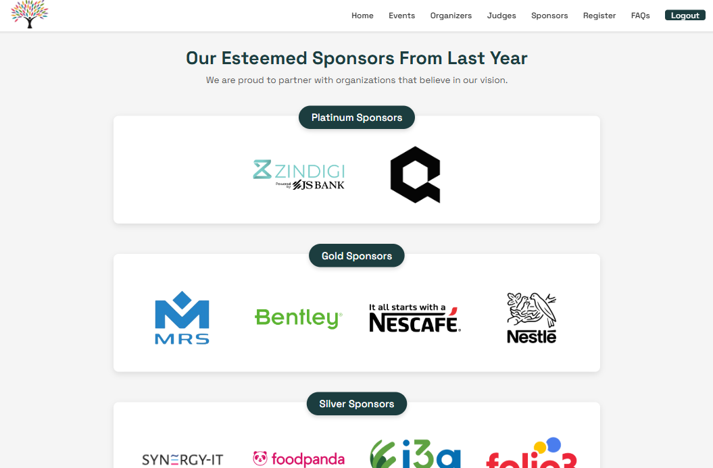

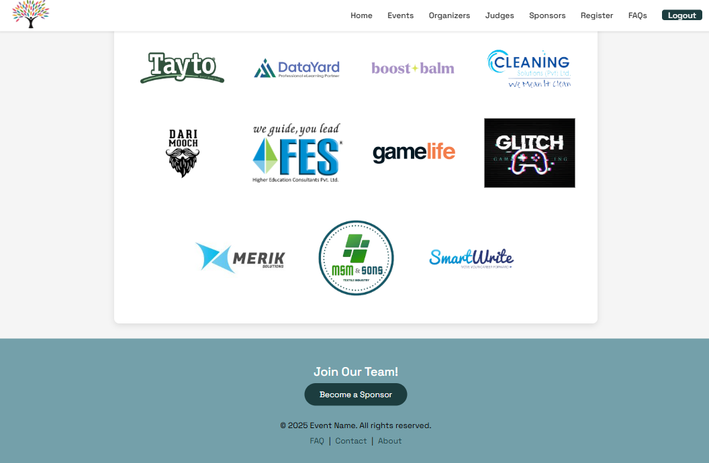

### FAQs Page
Common questions about NASCON, registration, and participation.

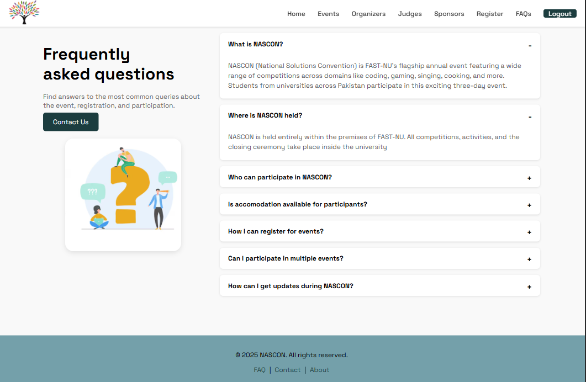

### Contact Us
Accessible from the FAQs page — reach out to the NASCON team.

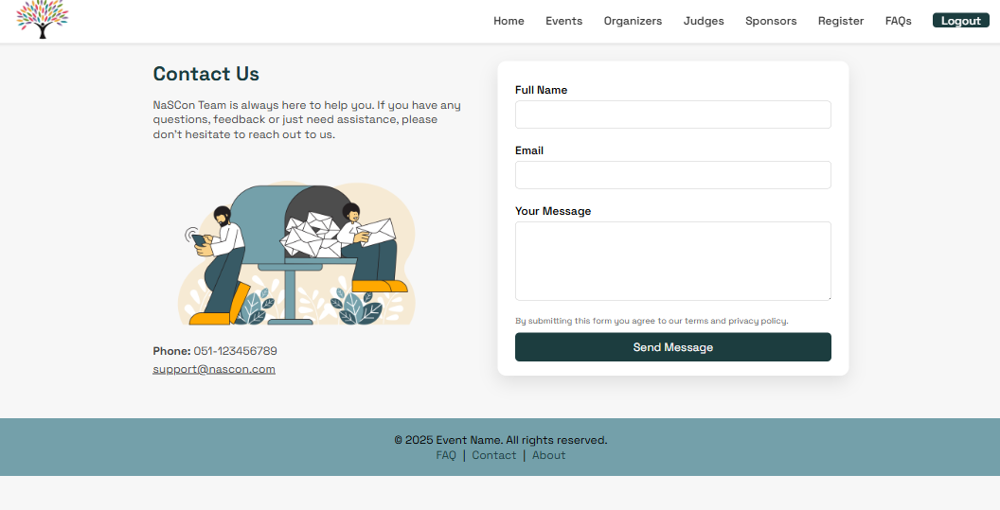

### Admin / Organizer Dashboard
View all participant registrations grouped by event, and all sponsor registrations.

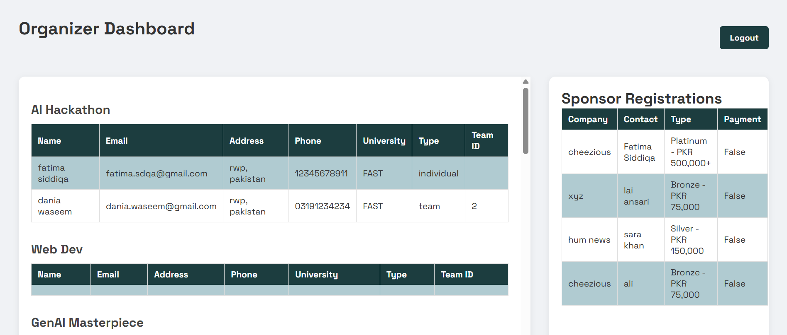

---

## Project Structure

```
nascon-management-system/
├── docs/
│   └── ER-Diagram.png
├── public/              # Frontend HTML, CSS, JS, images
├── screenshots/         # Screenshots added in the README.md file
├── database.js          # MySQL connection setup
├── database_schema.sql  # Full database schema and seed data
├── index.js             # Express server & API routes
├── package.json         # Project dependencies
├── package-lock.json
├── README.md
└── .gitignore
```

---

## Getting Started

### Prerequisites

- [Node.js](https://nodejs.org/) installed
- [MySQL](https://www.mysql.com/) installed and running (or MySQL Workbench)

### 1. Clone the Repository

```bash
git clone https://github.com/YOUR_USERNAME/nascon-management-system.git
cd nascon-management-system
```

### 2. Install Dependencies

```bash
npm install
```

### 3. Set Up the Database

Open **MySQL Workbench** (or any MySQL client) and run the provided SQL file to create and populate the database:

```sql
CREATE DATABASE project;
USE project;
-- Then run the full schema SQL file
```

The database includes the following tables:
`User`, `Participant`, `Team`, `Sponsor`, `SponsorshipPackage`, `Eventt`, `Venue`, `Accommodation`, `Judge`, `Score`, `Event_Organizer`, `Rules`, `Organizes`, `ParticRegistersFor`, `Evaluates`, `Payment`

## Database Design

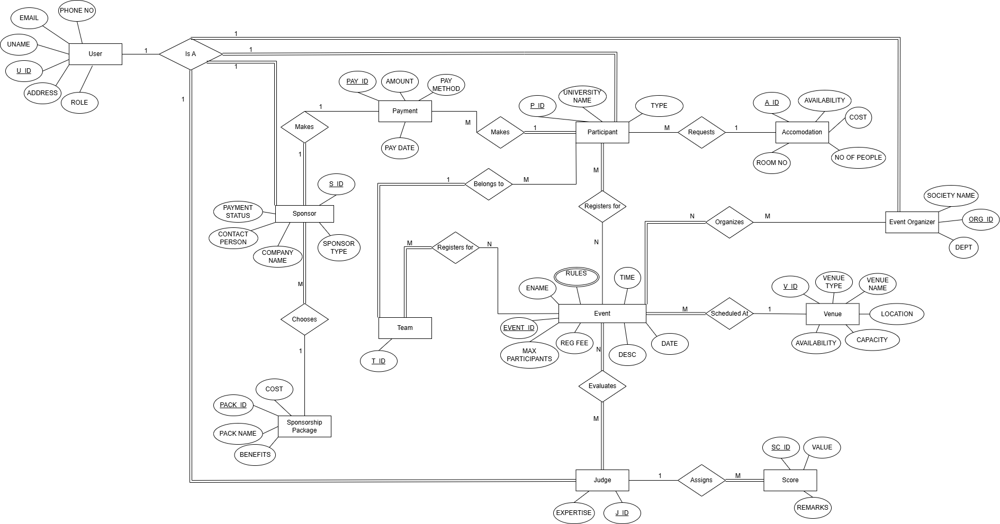

### 4. Configure Environment Variables

Create a `.env` file in the project root:

```
DB_HOST=localhost
DB_NAME=project
DB_USER=root
DB_PASS=your_mysql_password
```

> This file is listed in `.gitignore` and will never be committed to GitHub.

### 5. Run the Server

```bash
node index.js
```

### 6. Open in Browser

```
http://localhost:3000
```

---

## Usage Flow

| Role | After Login |
|------|-------------|
| **Participant** | Redirected to Home page; can browse events and register |
| **Sponsor** | Redirected to Sponsor page |
| **Event Organizer** | Redirected to Organizer Dashboard |
| **Admin** | Redirected to Admin/Organizer Dashboard |

---

## Events Supported

| Category | Events |
|----------|--------|
| Tech | AI Hackathon, Web Dev, GenAI Masterpiece, Edathon |
| Business | Entrepreneurial Venture, Business Scavenger Hunt, Case Quest, Crypto, Squid Bizz |
| Gaming | NASCON FIFA Frenzy, Tekken Iron Fist Championship, NASCON Valo Showdown |
| General | NASCON Got Talent, Bait Baazi, Dish It Out, Battle of the Bands |

---

## API Endpoints

| Method | Endpoint | Description |
|--------|----------|-------------|
| POST | `/register-individual` | Register an individual participant |
| POST | `/register-team` | Register a team of participants |
| POST | `/register-sponsor` | Register a sponsor |
| GET | `/api/participants-by-event` | Fetch all participants grouped by event |
| GET | `/api/sponsors` | Fetch all sponsor registrations |

---

## Notes

- Passwords in this project are stored as plain text — for production use, implement hashing (e.g. bcrypt).
- The `.env` file must be created manually on each machine; it is not included in the repository.
- If someone else clones this project, they need to run the SQL schema on their own MySQL instance and create their own `.env` file with their credentials.